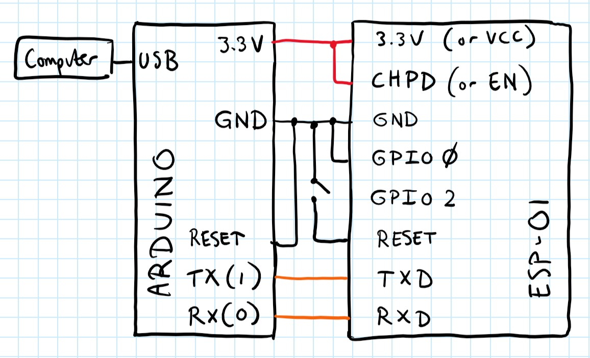
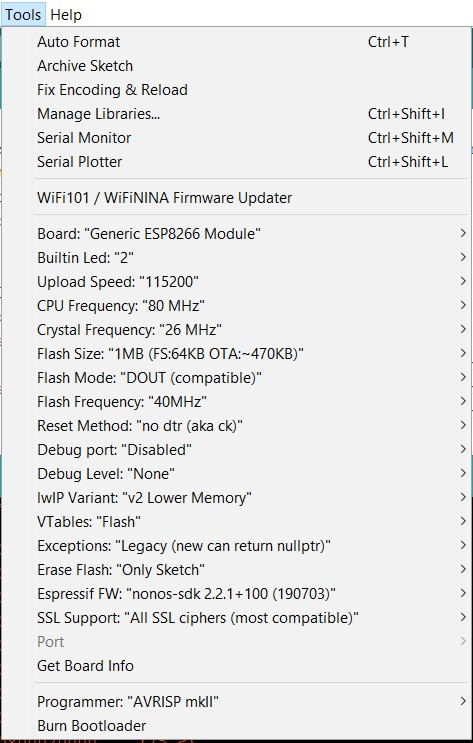

# WifiFirmware

Firmware to be uploaded to ESP8266 modules to interact with Vision System v5.1.x over WiFi.

## Programming the ESP8266

### Recommended Procedure: Using an Arduino Uno as a USB-to-Serial Converter

#### Step 1
Place the ESP-01 in an ESP-01 Breakout Board to easily access each pin on a breadboard. If you don't have a ESP-01 Breakout Board, use female-male wires to connect the ESP-01 directly to the arduino. Then connect the ESP-01, Arduino Uno, and your computer like this:

 

In text form, this is how the ESP-01 pins should be connected:

| Pin                             | Connection                                                   |
|---------------------------------|-------------------------------------------------------------:|
| TXD                             | Arduino Pin 1 (TX)                                           |
| CHPD (might also be called EN)  | 3.3V                                                         |
| RST                             | Unconnected, with an open switch or button to connect to GND |
| VCC (might also be called 3.3V) | Arduino 3.3V                                                 |
| GND                             | Arduino GND                                                  |
| GPIO2                           | Unconnected                                                  |
| GPIO0                           | GND                                                          |
| RXD                             | Arduino Pin 0 (RX)                                           |

This ensures the ESP-01 will boot in programming mode (GPIO0 to ground puts it in programming mode).

#### Step 2
Open the firmware.ino file from this repository in the Arduino IDE. Change line 5 to 1116 or 1215 depending on which room you want the module to work in.

#### Step 3
If you haven't done this before, go to **File > Preferences** (**Ctrl + Comma** on Windows or **⌘ + Comma** on macOS). In the textbox for "Additional Boards Manager URLs", insert `http://arduino.esp8266.com/stable/package_esp8266com_index.json`, then press OK. Update the board definitions by opening the Boards Manager (**Tools > Board > Boards Manager...**), finding "esp8266" on the list, selecting the latest version, and pressing Install. **This only needs to be done once.**

#### Step 4
Set all the options under the Tools menu like this (or as close as possible):

**Note:** The exact options here might change a bit depending on your version of the esp8266 board manager and your version of the Arduino IDE. The picture above is with esp8266 board manager version 2.6.3 and Arduino version 1.8.11. If you're having problems, try upgrading or downgrading to these versions. 

**Another Note:** When changing the board manager version, make sure to "Remove" the previous version you have installed before installing the new version. Don't just click "Update", or else the new version will install on top of the old version, and this will cause all sorts of weird problems.

**Another Note:** If you receive an error saying `Invalid (unsupported) command 0x8 esp8266`, try changing CPU frequency from 80 MHz --> 160 MHz. 

#### Step 5
Select the correct Port and click "Upload". Watch the upload output carefully. First connect the RST to GND and then when you see ``Connecting.....______....._____`` on the upload output, quickly switch the RST pin on the ESP8266 to +3.3V and keep there for the duration of the upload process. Then you should see some progress notifications, and the upload should complete successfully (ending with "soft reset.").

#### Step 6
Disconnect the newly flashed esp from the breadboard. Connect it to the 3.3V-to-5V converter. Test the esp with an arduino programmed with ENES100.print() statements (I like to use the Water example code found in **File > Examples > ENES100 > Water**.) You're done!

### Alternative Setup with Dedicated USB converter 
(Not recommended! We can't get this to work on most ESP-01 modules!)

The ESP8266 can be connected to a computer through a dedicated USB converter.

With a dedicated USB converter, the ESP8266 can be plugged in directly to the programming computer. Be sure that the converter is in programming mode (if it has more than one mode). For programing, connect VCC and enable to power, RX and TX to their appropriate inputs, and GND and GPIO0 to ground.

Open the sketch from this repository in Arduino IDE. Set the board type by selecting **Tools > Board > Generic ESP8266 Module**. Set the flash mode by selecting **Tools > Flash Mode > DIO**. Set the memory size by selecting **Tools > Flash Size > 1M (no SPIFFs)**. Set the programmer by selecting **Tools > Programmer > USBasp**. Set the appropriate port and click upload.

_Note: The ESP8266 may need to be reset between code uploads. Simply disconnect and reconnect the VCC connection._

## Using the Auto-flasher
Make sure you place the ESP in such that it covers the green area on the board. Next, make sure the switch is in the "up" position (for consistency, we will consider up to be when the green paint is on the right). Upload the firmware.ino file to the auto-flasher Arduino. Check the output console for when it starts to say ``Connecting.....______....._____``.
When this starts to display, change the switch from the "up" position to the "down" position. It should soon begin to print progress notifications and displasy the % progress. If it instead errors, try the process again.
